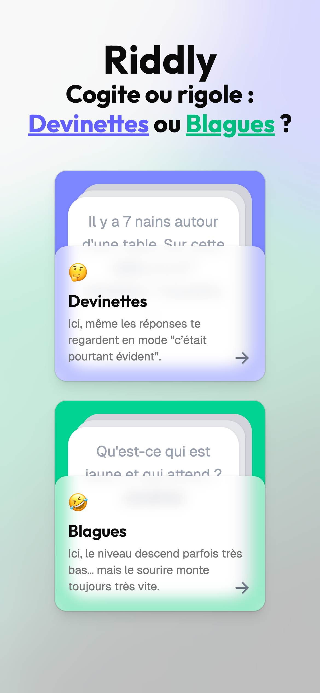
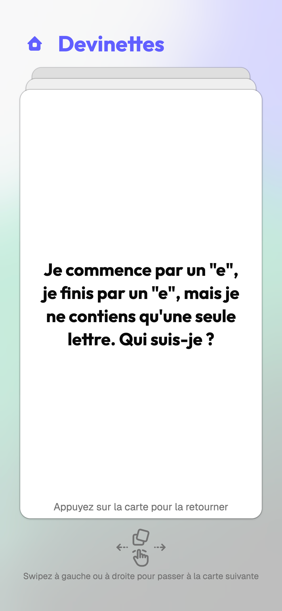
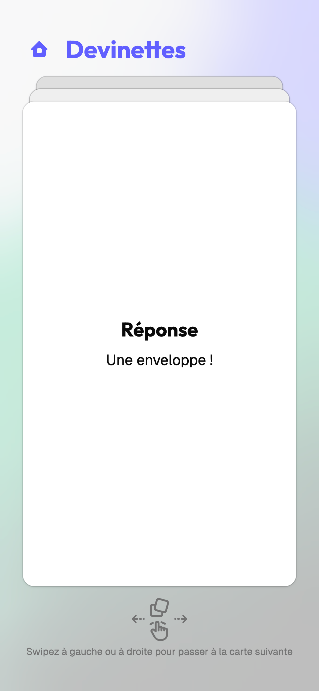
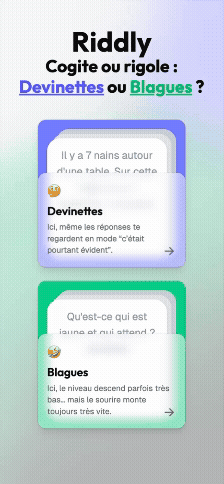

# Riddly

🃏 [Live demo (in french)](https://riddly.tom-depasse.be/) | 🇫🇷 [French version](README_fr.md)

## A stack of cards. Riddles, jokes. One swipe!

Riddly is a deck of cards in your pocket, meant to be pulled out with friends. One person holds the phone and plays game master: they read the card out loud to the other players, swipe to move on to the next one, and tap the card to flip it over. On the back, the hint and the answer sit side by side — theirs to drop at the right moment, when the room runs dry or when someone gets it. Nothing to install, no account to create: just enough to fill five minutes of waiting or throw a challenge at the next table.

## Screenshots
| Home screen                                                                | Card stack                                                                      | Card back                                                                       |
|----------------------------------------------------------------------------|---------------------------------------------------------------------------------|---------------------------------------------------------------------------------|
|      |      |        |

## Demo GIF


## Features
- Two modes: riddles and jokes, selectable from the home screen.
- Swipe left or right to move to the next card.
- Tap to reveal the hints and the answer.
- Mobile-first: designed for thumb use, but works great on desktop too.

## Tech stack
- **React 19** + **TypeScript** (strict), compiled by **Vite 8** with the **React Compiler** for automatic memoization.
- **TanStack Router** with file-based routing (route tree generated by its Vite plugin).
- **Tailwind CSS v4** with OKLCH theme variables, **shadcn/ui** (radix-nova style) on **Radix UI**, and **Tabler Icons**.
- **motion/react** for the drag, swipe and flip animations of the card stack.
- **PocketBase** as the backend (cards, categories).
- **ESLint** (with kebab-case file naming rules) + **Prettier** for code quality.

## Installation

Node.js `^20.19` or `>=22.12` (required by Vite 8) and npm.

```bash
git clone git@github.com:tomd7/riddly.git
cd riddly
npm install
cp .env.example .env
npm run dev
```

That's it — `.env.example` already points at the public PocketBase instance, so the app runs against the real deck out of the box. It is then served on `http://localhost:5173` (the dev server runs with `--host`, so it is also reachable from your phone on the same network).

### Scripts
| Command           | Description                                  |
|-------------------|----------------------------------------------|
| `npm run dev`     | Start the Vite dev server                    |
| `npm run build`   | Type check (`tsc -b`) then production build  |
| `npm run preview` | Serve the production build locally           |
| `npm run lint`    | Run ESLint across the project                |

### Running your own backend
The public instance is read-only. To point `VITE_PB_URL` at your own [PocketBase](https://pocketbase.io/), it needs two collections with public `list` and `view` rules:

| Collection        | Fields                                                                                                    |
|-------------------|-----------------------------------------------------------------------------------------------------------|
| `card_categories` | `label`, `color`, `icon`, `description`, `route`, `example`, `deleted` (bool)                             |
| `humour_cards`    | `title`, `hint`, `answer`, `type` (`riddle` \| `joke`), `deleted` (bool), `category` and `sub_category` (relations to `card_categories`) |

## Roadmap
Upcoming features:

- [ ] Onboarding on first app launch: a mini tour of the gestures (swipe/tap) for newcomers.
- [ ] Backoffice (with auth) to manage cards.
- [ ] Favorites and "already seen" history
- [ ] Undo the last swipe
- [ ] Game modes: solo, party (with a game master), online multiplayer.
- [ ] Card categories: geeky, sports, political, etc.
- [ ] Joke/riddle of the day
- [ ] Card skins